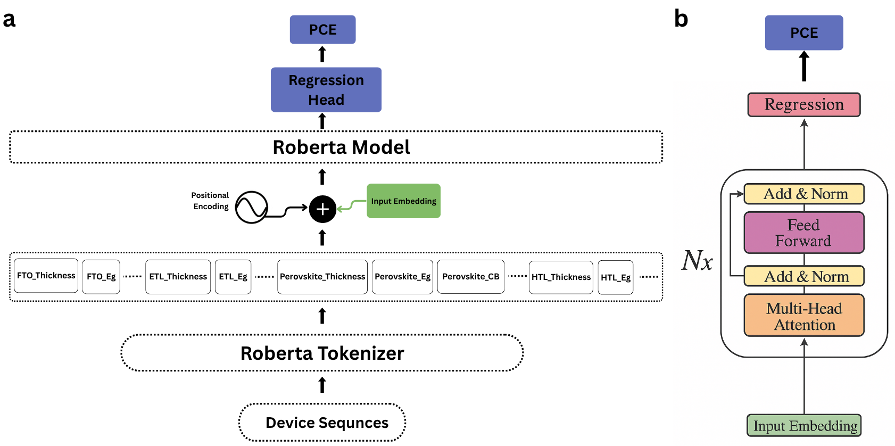
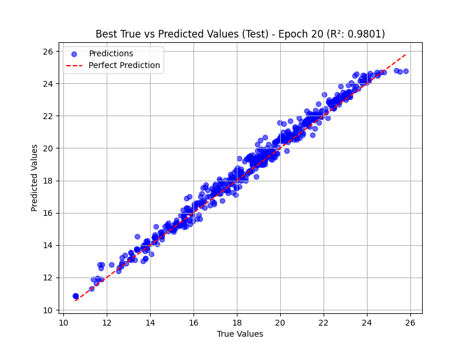
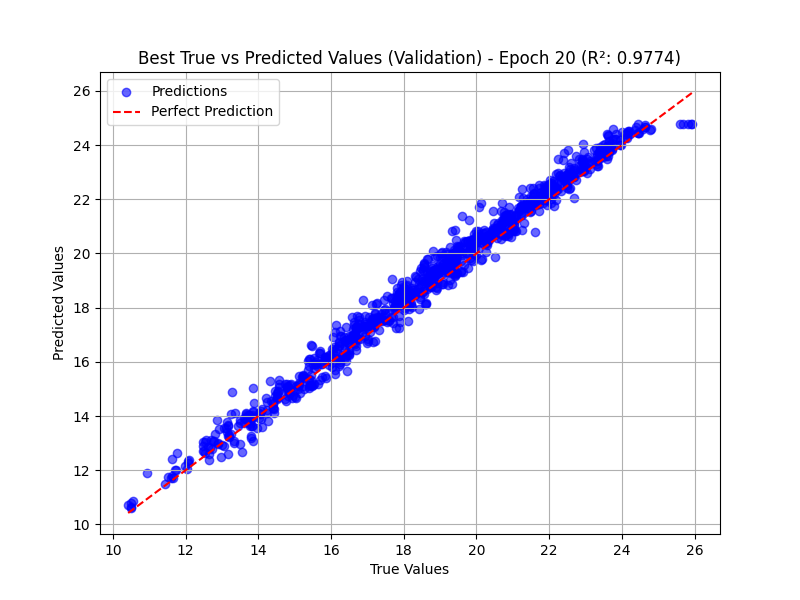
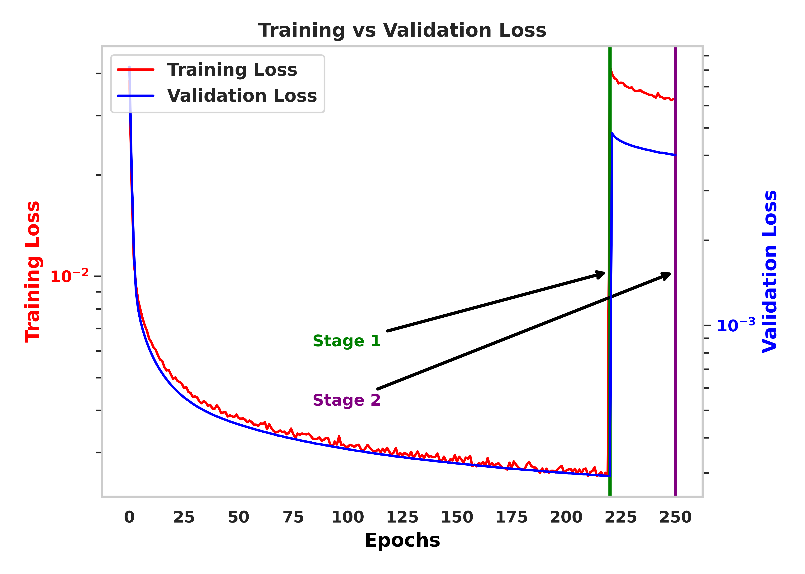
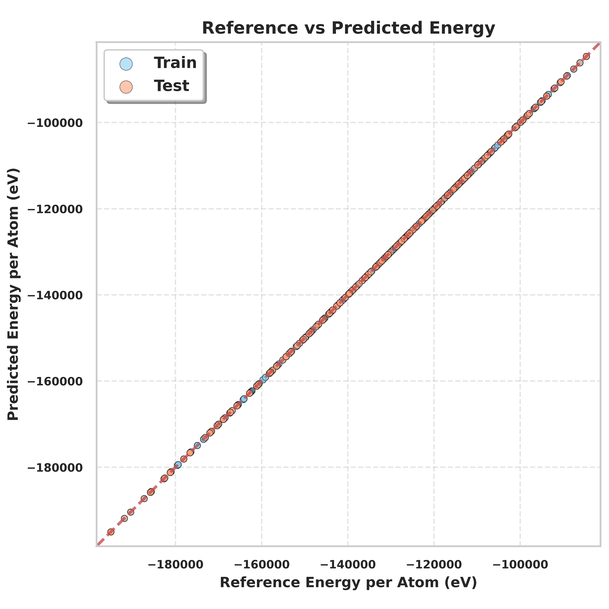
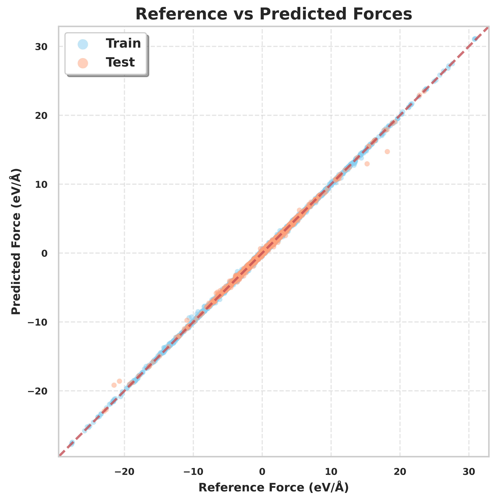

# PervoTransformer: AI-Driven Optimization of Perovskite Solar Cells


**PervoTransformer** is a multi-model AI framework for the design and optimization of perovskite solar cells (PSCs). It combines **RoBERTa** for predictive modeling of power conversion efficiency (PCE) and **GPT-2** for generative design of new solar cell architectures.The framework also leverages MACE machine learning potentials for accurate force and energy predictions of Cs-Sn based perovskites. Using this approach, new high-PCE candidate structures were generated, enabling accelerated exploration and optimization of solar cell materials.


---

## 🔬 Project Overview

- **Problem:** Efficiently designing perovskite solar cells with high power conversion efficiency.
- **Approach:** 
  - Sequence-based generative modeling using GPT-2 to propose novel perovskite structures.
  - RoBERTa-based property prediction for PCE evaluation of device sequences.
  - Fine-tuning of MACE machine learning interatomic potentials for Cs-Sn based perovskite materials.
- **Outcome:** Generated new device architectures with predicted higher PCE than existing literature examples.

---

## 📂 Repository Structure

- `data/`: Original and processed datasets.
- `notebooks/`: Jupyter notebooks for exploration, training, and generation.
- `models/`: Fine-tuned RoBERTa and GPT-2 models.
- `results/`: Plots, tables, and evaluation metrics.
- `scripts/`: Python scripts for training, generation, and evaluation.

---

## 📈 Key Results

### 1️⃣ PCE Prediction Performance
<p align="center">
  
  
</p>

- **Description:** Predicted vs actual PCE for validation devices. Shows strong correlation, confirming model’s predictive accuracy.

### 2️⃣ GPT-2 Generated Structures
<p align="center">
  
</p>
- **Description:** GPT-2 training loss during fine-tuning. Shows model convergence for generating perovskite structures.

### 3️⃣ MACE Potential Validation
<p align="center">
  
</p>

<p align="center">
  
  
</p>

- **Description:** Comparison of predicted vs reference forces and energies for Cs-Sn based perovskites. Confirms accuracy of MACE potentials.


## ⚡ Usage

```bash
# Install requirements
pip install -r requirements.txt

# Run RoBERTa fine-tuning
python scripts/train_roberta.py --data data/processed/train.csv

# Generate new structures with GPT-2
python scripts/generate_structures_gpt2.py --num_samples 100

# Evaluate models and plot results
python scripts/evaluate_models.py
